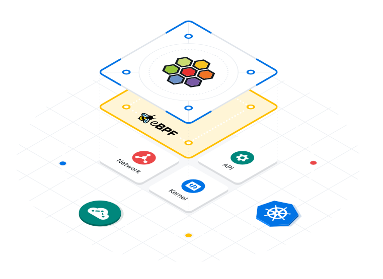

# cilium-sandbox

## Overview

Cilium is an open-source software project that provides network and API security for modern, cloud-native applications. It aims to enhance the security, visibility, and reliability of application networking in Kubernetes and other containerized environments. This is my personal docs from training on the internet to learning Cillium in Certain Use-Cases.

## Features
- **BPF-based Networking:** Cilium leverages eBPF (Extended Berkeley Packet Filter) to perform high-performance network filtering and security tasks, providing granular control over network traffic.

- **Service Mesh Integration:** Cilium can seamlessly integrate with popular service mesh solutions like Istio, enabling advanced networking features such as load balancing, service discovery, and mTLS (mutual Transport Layer Security).

- **Network Security Policies:** The project allows users to define and enforce fine-grained network security policies to protect applications from unauthorized access and ensure compliance.

- **API-Aware Security:** Cilium operates at the application layer, enabling application-aware security and deep visibility into API communication for enhanced monitoring and troubleshooting.

- **Transparent Encryption:** Cilium can automatically encrypt communication between services using encryption protocols like IPSec, securing data in transit.

- **Kubernetes-Native:** Cilium is designed to integrate smoothly with Kubernetes and takes advantage of native Kubernetes features to simplify deployment and management.

- **Distributed Load Balancing:** The project includes a distributed load balancer, enhancing application resilience and performance.

- **Layer 7 HTTP/HTTPS Aware:** Cilium can perform Layer 7 (HTTP/HTTPS) filtering and security, allowing for intelligent traffic routing and control.

- **Observability and Tracing:** Cilium provides powerful observability tools, including Prometheus metrics, Grafana dashboards, and distributed tracing via Zipkin or Jaeger.

## Getting Started
To get started with Cilium, you can follow these steps:

1. **Requirements:** Ensure you have a Kubernetes cluster set up and running.

2. **Installation:** Install Cilium on your Kubernetes cluster using Helm or other deployment methods outlined in the official documentation.

3. **Configuration:** Customize Cilium's behavior using YAML-based configurations, defining network security policies, encryption settings, and other options.

4. **Integrate with Service Mesh:** If using a service mesh like Istio, follow the integration guide to enable advanced networking features.

5. **Monitoring:** Set up monitoring and observability tools to gain insights into your network and application traffic.

6. **Test and Iterate:** Test your applications and network policies, iterating as needed to achieve the desired security and performance outcomes.

## Resources
- Official Website: [https://cilium.io/](https://cilium.io/)
- GitHub Repository: [https://github.com/cilium/cilium](https://github.com/cilium/cilium)
- Documentation: [https://docs.cilium.io/](https://docs.cilium.io/)
- Slack Community: [https://cilium.slack.com/](https://cilium.slack.com/)

## Community and Support
Cilium has a vibrant community that actively contributes to the project. If you need help, have questions, or want to get involved, consider joining the Slack community or exploring the official documentation.

