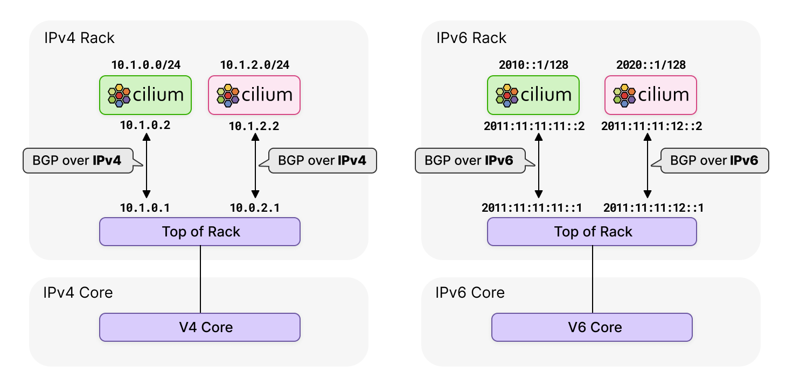

# 🌐 BGP is a Data Center Standard

BGP is not just the foundational protocol behind the Internet; it is now the standard within data centers.

Modern data center network fabrics are typically based on a “leaf-and-spine” architecture where BGP is typically used to propagate endpoint reachability information.

Given that such endpoints can be Kubernetes Pods, it was natural that Cilium should introduce support for BGP.

In this lab, you will be deploying BGP with Cilium and peer with a virtual leaf/spine data center network. By the end of the lab, you will see how easy it is to connect your data center network with your Cilium-managed Kubernetes clusters!

# ⬢ BGP Support in Cilium

BGP support was initially introduced in Cilium 1.10 and subsequent improvements have been made since, such as the recent introduction of IPv6 support in Cilium 1.12.

The following video shows an introduction and a demo of the new BGP features in Cilium 1.12.

https://youtu.be/AXTKS0WCXjE

# 💻 Networking Fabric

To showcase the Cilium BGP feature, we need a BGP-capable device to peer with.

For this purpose, we will be leveraging Containerlab and FRR (Free Range Routing). These great tools provide the ability to simulate networking environment in containers.

# 🧪 Containerlab

Containerlab is a platform that enables users to deploy virtual networking topologies, based on containers and virtual machines. One of the virtual routing appliances that can be deployed via Containerlab is FRR - a feature-rich open-source networking platform.

By the end of the lab, you will have established BGP peering with the FRR virtual devices.


## Demo



Let's have a look at this lab's environment.

We are going to be using Kind to set up our Kubernetes cluster, and on top of that Cilium.

### Deploy Kubernetes Cluster

Let's deploy the Kubernetes cluster:

```
kind create cluster --config cluster.yaml
```

The deployment should take less than a minute.

### Install Containerlab

We can install containerlab with a single command:

```
bash -c "$(curl -sL https://get.containerlab.dev)" -- -v 0.31.1
```

Containerlab takes some of the best aspects of modern infrastructure deployment and applies them to networking:

- You can use a declarative approach by writing network topologies in YAML
- You can leverage open source and commercial routing platforms (in our case, the open source Free Range Routing platform (FRR))
- You can use containers or virtual-machine to deploy your topology
- You can leverage topology models that others have built (as users can share theirs on version control systems like GitHub).

In our case, we are using a topology file called `topo.yaml`. The topology file describes the networking platform to be deployed by containerlab.

### Deploy Kubernetes Cluster

If you're curious, you can check out in details the containerlab topology we are deploying as part of the lab.

```
cat topo.yaml
```

The main thing to notice is that we are deploying 3 main routing nodes: a backbone router (router0) and two Top of Rack (ToR) routers (tor0 and tor1). We are pre-configuring them at boot time with their IP and BGP configuration. At the end of the YAML file, you will also note we are establishing virtual links between the backbone and the ToR routers.

In the following tasks, we will configure Cilium to run BGP on the kind nodes and to establish BGP peering with the ToR devices.

Here is what the overall final topology looks like (note you can resize this window if the diagram is too small):


### Deploy Network Topology

With the following command, we can deploy the topology previously described.

```
containerlab -t topo.yaml deploy
```

This typically only takes a few seconds to deploy.

### Verify Connectivity

At this stage, BGP should be up between our Top of Rack switches and the backbone router router0.


Let's verify this with this command.

```
docker exec -it clab-bgp-cplane-demo-router0 vtysh -c 'show bgp ipv4 summary wide'
```

Let's explain briefly this command.

- docker exec -it lets us enter the router0 shell. As mentioned earlier, router0 is based on the open-source Free Range Routing platform (FRR).
- vtysh is the integrated shell on FRR devices.
- show bgp ipv4 summary wide lets us check the BGP status.

Once you run this command, you will an output such as:

```
IPv4 Unicast Summary (VRF default):
BGP router identifier 10.0.0.0, local AS number 65000 vrf-id 0

Neighbor        V         AS    LocalAS   MsgRcvd   MsgSent   TblVer  InQ OutQ  Up/Down State/PfxRcd   PfxSnt Desc
tor0(net0)      4      65010      65000        42        41        0    0    0 00:01:42            3        9 N/A
tor1(net1)      4      65011      65000        42        42        0    0    0 00:01:41            3        9 N/A

Total number of neighbors 2
```

If you're familiar with using BGP on traditional CLIs such as Cisco IOS, this will look familiar. If not, let's go through some of the key outputs of the command above.

This commands provides information about the BGP status on router0. It shows router0's local AS number (65000), the remote AS number of the routers it is peering with (65010 for tor0 and 65011 for tor1).

It also shows, in the Up/Down column where the session is established (if that's the case, it will show for how long the session has been up - in our case, it's been up for 00:01:41).

Finally, it shows how many prefixes have been received and sent (see State/PfxRcd and PfxSnt).

Let's run this command on the Top of Rack switches. Two of the sessions remain "Active" - it means the peering sessions are configured and actively trying to peer but they are not established yet.

It's to be expected: BGP is not established with the Kind nodes as we haven't deployed Cilium yet.

On tor0:

```
docker exec -it clab-bgp-cplane-demo-tor0 vtysh -c 'show bgp ipv4 summary wide'
```

On tor1:

```
docker exec -it clab-bgp-cplane-demo-tor1 vtysh -c 'show bgp ipv4 summary wide'
```

In the next step, we will be deploying Cilium on the nodes.

```
containerlab -t topo.yaml deploy
```

This typically only takes a few seconds to deploy.

### Cilium CLI

The cilium CLI tool is provided in this environment to install and check the status of Cilium in the cluster.

Let's start by installing Cilium on the Kind cluster, with BGP enabled.

```
cilium install \
    --helm-set ipam.mode=kubernetes \
    --helm-set tunnel=disabled \
    --helm-set ipv4NativeRoutingCIDR="10.0.0.0/8" \
    --helm-set bgpControlPlane.enabled=true \
    --helm-set k8s.requireIPv4PodCIDR=true
```

The installation usually takes a couple of minutes. While we wait for the installation to complete, let's review some Cilium BGP aspects:

- As you can see in the Cilium Helm values above, bgpControlPlane is the main requirement to enable BGP on Cilium.
- The configuration for BGP peers and Autonomous System Numbers (ASN) will be configured through a Kubernetes CRD (that's the next task).

For more details on the BGP configuration options, you can read up more on the official [Cilium BGP documentation](https://docs.cilium.io/en/v1.12/gettingstarted/bgp-control-plane/).

The installation should now have finished. Let's verify the status of Cilium:

```
cilium status
```

Cilium is now functional on our cluster.

Let's verify that BGP has been successfully enabled by checking the Cilium configuration:

```
cilium config view | grep enable-bgp
```

Next, we are going to deploy our BGP Peering Policies and verify that the BGP sessions are established.

### BGP Configuration

Let's first walk through the BGP Peering configuration.

Peering policies can be provisioned using simple Kubernetes CRDs, of the kind `CiliumBGPPeeringPolicy`.

```
cat cilium-bgp-peering-policies.yaml
```

The key aspects of the policy are:

- the remote peer IP address (peerAddress) and AS Number (peerASN)
- your own local AS Number (localASN) And that's it!

In this lab, we specify the loopback IP addresses of our BGP peers: the Top of Rack devices `tor0` (10.0.0.1/32) and `tor1` (10.0.0.2/32).

Note that BGP configuration on Cilium is label-based - the Cilium-managed nodes with a matching label will deploy a virtual router for BGP peering purposes.

Verify the label configuration with the following commands:

```
kubectl get nodes -l 'rack in (rack0,rack1)'
```

For more details on the BGP configuration options, you can read up the official Cilium [BGP documentations](https://docs.cilium.io/en/v1.12/gettingstarted/bgp-control-plane/).

### Deploy BGP Peering Policies CRD Configuration

It's time to now deploy the BGP peering policy.

```
kubectl apply -f cilium-bgp-peering-policies.yaml
```

### Verify Succesful BGP Peering

Now that we have set up our BGP peering, the peering sessions between the Cilium nodes and the Top of Rack switches should be established successfully. Let's verify that the sessions have been established and that routes are learned successfully (it might take a few seconds for the sessions to come up).

On tor0:

```
docker exec -it clab-bgp-cplane-demo-tor0 vtysh -c 'show bgp ipv4 summary wide'
```

On tor1:

```
docker exec -it clab-bgp-cplane-demo-tor1 vtysh -c 'show bgp ipv4 summary wide'
```
This time, you should see that the session between the ToR devices and the Cilium nodes are no longer "Active" (that is to say, unsuccessfully trying to establish peering) but up (you will see how long the session has been up on the Up/Down column).

### Deploy Networking Util Pods

We will also be deploying a networking utility called netshoot by using a DaemonSet. We will be using it to verify end-to-end connectivity at the end of the lab.

```
kubectl apply -f netshoot-ds.yaml
```

To verify the netshoot pods have been successfully deployed, simply run:

```
kubectl rollout status ds/netshoot -w
```

It should take 30 seconds for the Pods to be ready.

### Verify end-to-end Conncetivity

We will now be running a series of connectivity tests, from a source Pod on a node in rack0 to a destination Pod in rack1. These packets will traverse the our virtual networking backbone and validate that the whole data path is working as expected.

Run the following commands.

First, let's find the name of a source Pod in rack0.

```
SRC_POD=$(kubectl get pods -o wide | grep "cplane-demo-worker " | awk '{ print($1); }')
```

Next, let's get the IP address of a destination Pod in rack1.

```
DST_IP=$(kubectl get pods -o wide | grep worker3 | awk '{ print($6); }')
```

Finally, let's execute a ping from the source Pod to the destination IP.

```
kubectl exec -it $SRC_POD -- ping $DST_IP
```

You should see packets flowing across your virtual data center. Well done: your Kubernetes Pods located in different rack servers in your (virtual) datacenter can communicate together across the network backbone! 🥳

Great job - you have successfully completed this lab and now understand how you can use BGP on Cilium to easily connect your Kubernetes clusters to your DC network.

### What's Next

Click on the green button to submit your feedback on the lab. On completion of this lab, you will be redirected to the Isovalent Labs page. Why don't you do the next BGP lab (Load-Balancer IPAM and BGP Service Advertisement)

