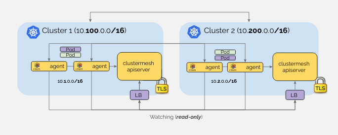
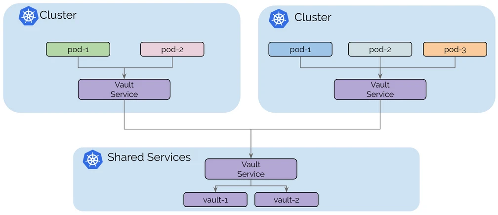
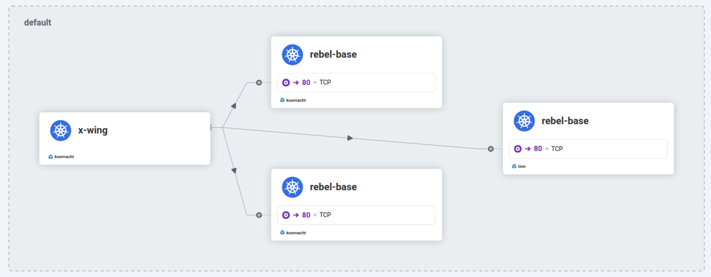
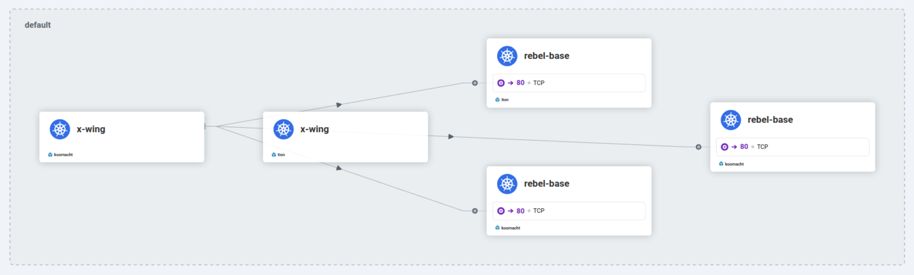
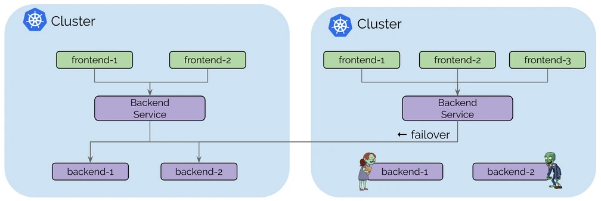
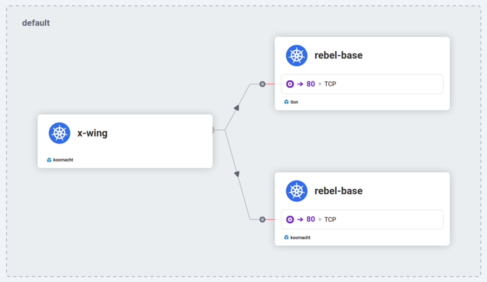

# 🏛️ Cluster Mesh Architecture



When activating Cluster Mesh on Cilium clusters, a new Control Plane is deployed to manage the mesh for this cluster, along with its etcd key-value store.

Agents of other clusters can then access this Cluster Mesh Control Plane in read-only mode, allowing them to access metadata about the cluster, such as Service names and corresponding IPs.

## 👍 Requirements for Cluster Mesh

Cilium Cluster Mesh allows to link multiple Kubernetes clusters, provided:

- all clusters run Cilium as CNI
- all worker nodes have a unique IP address and are able to connect to each other


# 🧪 Lab Installation Setup

In this lab, we will create two Kind clusters and mesh them using Cilium.

We'll have two requirements for these clusters:

1. disable default CNI so we can easily install Cilium
2. use disjoint pods and services subnets

## Koornacht Cluster

Let's have a look at the configuration for the first cluster, which we will be calling Koornacht:

```
# ⚠️ In the Koornacht tab
cat kind_koornacht.yaml
```

This cluster will feature one control-plane node and 2 worker nodes, and use 10.1.0.0/16 for the Pod network, and 172.20.1.0/24 for the Services.

Create the Koornacht first cluster with:

```
# ⚠️ In the Koornacht tab
kind create cluster --name koornacht --config kind_koornacht.yaml
```

This usually takes about 1 minute.

Verify that all 3 nodes are up:

```
# ⚠️ In the Koornacht tab
kubectl get nodes
```

The nodes are marked as NotReady because there is not CNI plugin set up yet.

Then install Cilium on it:

```
# ⚠️ In the Koornacht tab
cilium install --cluster-name koornacht --cluster-id 1 --ipam kubernetes
```

Let's also enable Hubble for observability, only on the Koornacht cluster:

```
# ⚠️ In the Koornacht tab
cilium hubble enable --ui
```

Verify that everything is fine with:

```
# ⚠️ In the Koornacht tab
cilium status
```

## Tion Cluster

Let's now create a second Kind cluster —which we will call Tion— with the following configuration:

```
# ⚠️ In the Tion tab
cat kind_tion.yaml
```

This Tion cluster will also feature one control-plane node and 2 worker nodes, but it will use 10.2.0.0/16 for the Pod network, and 172.20.2.0/24 for the Services.

Create the Tion cluster with:

```
# ⚠️ In the Tion tab
kind create cluster --name tion --config kind_tion.yaml
```

Verify that all 3 nodes are up:

```
# ⚠️ In the Tion tab
kubectl get nodes
```

Then install Cilium on it:

```
# ⚠️ In the Tion tab
cilium install --cluster-name tion --cluster-id 2 --ipam kubernetes
```

Verify that everything is fine with:

```
# ⚠️ In the Tion tab
cilium status
```

Now that we have two Kind clusters installed with Cilium, let's get them meshed!

## Enable & Connect Cluster Mesh

Enable Cluster Mesh on both clusters:

```
# ⚠️ In *both* the Koornacht and Tion tabs
cilium clustermesh enable --service-type NodePort
```

    🛈 Note

    Several types of connectivity can be set up. We're using NodePort in our case as it's easier and we don't have dynamic load balancers available.

    For production clusters, it is strongly recommended to use LoadBalancer instead.

Wait for Cluster Mesh to be ready on both clusters:

```
# ⚠️ In *both* the Koornacht and Tion tabs
cilium clustermesh status --wait
```
You can also verify the Cluster Mesh status with cilium status:

```
# ⚠️ In *both* the Koornacht and Tion tabs
cilium status
```

You should see a `ClusterMesh: OK` field.

Let's now connect the clusters by instructing one cluster to mesh with the second one. This needs to be done in a shell with access to both cluster contexts, so we'll use the 🌐 Global tab for that:

```
# ⚠️ In the Global tab
cilium clustermesh connect --context kind-koornacht --destination-context kind-tion
```

Wait for both clusters to be ready:

```
# ⚠️ In *both* the Koornacht and Tion tabs
cilium clustermesh status --wait
```

Our two clusters are now meshed together. Let's deploy applications on them!


# 🌌 Deploying an application

We will now deploy a sample application on both Kubernetes clusters.

This application will contain two deployments:

- a simple HTTP application called rebel-base, which will return a static JSON document
- an x-wing pod which we will use to make requests to the rebel-base service from within the cluster

The only difference between the two deployments will be the ConfigMap resource deployed, which will contain the static JSON document served by rebel-base, and whose content will depend on the cluster.

Are you ready? Let's go!

## Koornacht Cluster
Let's prepare to deploy on the Koornacht Cluster.

We will deploy a simple HTTP application returning a JSON, including the name of the cluster:

```
# ⚠️ In the Koornacht tab
kubectl apply -f deployment.yaml
```

The ConfigMap for this service contains the JSON reply, with the name of the Cluster hardcoded (-o yaml is added here to show you the content of the resource):

```
# ⚠️ In the Koornacht tab
kubectl apply -f configmap_koornacht.yaml -o yaml
```

Check that the pods are running properly (launch until all 4 pods are Running):

```
# ⚠️ In the Koornacht tab
kubectl get pod
```

You should see something like:

```
NAME                          READY   STATUS    RESTARTS   AGE
rebel-base-6985d8f76f-n6qmm   1/1     Running   0          44s
rebel-base-6985d8f76f-rn4ht   1/1     Running   0          44s
x-wing-6d58648f95-2mrpc       1/1     Running   0          40s
x-wing-6d58648f95-nw927       1/1     Running   0          40s
```

Apply the Service for the application:

```
# ⚠️ In the Koornacht tab
kubectl apply -f service.yaml
```

Let's test this service, using the x-wing pod deployed alongside the rebel-base deployment:

```
# ⚠️ In the Koornacht tab
kubectl exec -ti deployments/x-wing -- /bin/sh -c 'for i in $(seq 1 10); do curl rebel-base; done'
```

You should see 10 lines of log, all containing:

`{"Cluster": "Koornacht", "Planet": "N'Zoth"}`

Go the 🔗 🛰️ Hubble UI tab and select the default namespace. You will see the x-wing requests being sent to the rebel-base pods.

## Tion Cluster

We will deploy the same application and service on the Tion cluster, with a small difference: the JSON answer will reply with Tion since we're using a slightly different ConfigMap:

```
# ⚠️ In the Tion tab
kubectl apply -f deployment.yaml
kubectl apply -f configmap_tion.yaml -o yaml
kubectl apply -f service.yaml
```

Wait until the pods are ready (run kubectl get po until all pods are Ready) and check this second service:

```
# ⚠️ In the Tion tab
kubectl exec -ti deployments/x-wing -- /bin/sh -c 'for i in $(seq 1 10); do curl rebel-base; done'
```

After the pods start, you should see 10 lines of log, all containing:

`{"Cluster": "Tion", "Planet": "Foran Tutha"}`

We now have similar applications running on both our clusters. Wouldn't it be great if we could load-balance traffic between them? This is precisely what we'll be doing in the next challenge!

# 🌍 Making Services Global

When two or more clusters are meshed, Cilium allows you to set services as global in one or more clusters, by adding an annotation to them:

`service.cilium.io/global: "true"`

When this annotation is set, requests to this service will load-balance to all available services with the same name and namespace in all meshed clusters.

## 🤲 Shared services

Another use case of global services is shared services.



This is particularly usefull when sharing stateful services between multiple Kubernetes clusters. If all clusters are meshed, the stateless applications spread among multiple clusters can all access the stateful services located on a single shared cluster.

## 🌍 Global Service

Let's make the service global on the mesh. Add the annotation to the service metadata:

```
# ⚠️ In *both* the Koornacht and Tion tabs
kubectl annotate service rebel-base service.cilium.io/global="true"
```

When accessing the service from either cluster, it should now be load-balanced between the two clusters, because it is marked as global:

```
# ⚠️ In the Koornacht tab
kubectl exec -ti deployments/x-wing -- /bin/sh -c 'for i in $(seq 1 10); do curl rebel-base; done'
```

You should see a mix of replies from the Koornacht and Tion clusters:
```
{"Cluster": "Koornacht", "Planet": "N'Zoth"}
{"Cluster": "Koornacht", "Planet": "N'Zoth"}
{"Cluster": "Koornacht", "Planet": "N'Zoth"}
{"Cluster": "Tion", "Planet": "Foran Tutha"}
{"Cluster": "Tion", "Planet": "Foran Tutha"}
{"Cluster": "Koornacht", "Planet": "N'Zoth"}
{"Cluster": "Tion", "Planet": "Foran Tutha"}
```

Check the 🔗 🛰️ Hubble UI tab After a little while, you will see the x-wing pod from the Koornacht cluster accessing rebel-base pods from both the Koornacht and Tion clusters.



Traffic from Koornacht to both clusters

Now test also from the Tion cluster:

```
# ⚠️ In the Tion tab
kubectl exec -ti deployments/x-wing -- /bin/sh -c 'for i in $(seq 1 10); do curl rebel-base; done'
```

You should see requests being load-balanced between the two clusters.

Verify the 🔗 🛰️ Hubble UI tab that you see traffic coming from the Tion cluster to the Koornacht rebel-base pods.



The service is now global on both clusters!

## 💥 Fault Resilience

One obvious usage of global services is fault tolerance.



If a service becomes unavailable in one cluster, traffic can be redirected to the same service in other clusters, ensuring a continuity of service.

With that setup in place above, let's scale down the deployment on the Koornacht cluster:

```
# ⚠️ In the Koornacht tab
kubectl scale deployment rebel-base --replicas 0
```

Now check the replies when querying from the Koornacht cluster:

```
# ⚠️ In the Koornacht tab
kubectl exec -ti deployments/x-wing -- /bin/sh -c 'for i in $(seq 1 10); do curl rebel-base; done'
```

And from the Tion cluster:

```
# ⚠️ In the Tion tab
kubectl exec -ti deployments/x-wing -- /bin/sh -c 'for i in $(seq 1 10); do curl rebel-base; done'
```

You should see only entries like:

`{"Cluster": "Tion", "Planet": "Foran Tutha"}`

You can see that requesting the service on both clusters now only yields answers from the Tion cluster, effectively making up for the missing pods on the Koornacht cluster.

We've now seen how clusters can access all instances of an identical service across meshed cluster. What if we want to remove one specific instance of the service from the global service? We'll see how to do this in the next challenge!

# 🌎 Global vs Shared

We've seen how the `service.cilium.io/global` annotation allows for a cluster to load-balance requests to a service to all meshed clusters with the same annotated service.

What if you want to remove the service of a specific cluster from the global service?

The `service.cilium.io/shared` annotation can be used for this.

## ⬆️ Scaling up Service on Koornact

First, let's scale deployment on the Koornacht cluster back to two:

```
# ⚠️ In the Koornacht tab
kubectl scale deployment rebel-base --replicas 2
```

Verify that the service is properly load-balanced from the Koornacht cluster:

```
# ⚠️ In the Koornacht tab
kubectl exec -ti deployments/x-wing -- /bin/sh -c 'for i in $(seq 1 10); do curl rebel-base; done'
```

And from the Tion cluster:

```
# ⚠️ In the Tion tab
kubectl exec -ti deployments/x-wing -- /bin/sh -c 'for i in $(seq 1 10); do curl rebel-base; done'
```

## 🚫 Disabling Global Service

By default, a service marked as global is considered shared as well, so the value of `service.cilium.io/shared` is `true` for all clusters where the service is marked as global.

Setting it to `false` in a cluster removes that specific service from the global service:

`service.cilium.io/shared: "false"`

Now we want to prevent the Tion cluster from accessing the service running on the Koornacht cluster. Let's add the service.cilium.io/shared=false annotation to the service on Koornacht to opt out of the global service:

```
# ⚠️ In the Koornacht tab
kubectl annotate service rebel-base service.cilium.io/shared="false"
```

From the Koornacht cluster, requests are still load-balanced, as the service is global and the Tion cluster is allowing its service to be shared:

```
# ⚠️ In the Koornacht tab
kubectl exec -ti deployments/x-wing -- /bin/sh -c 'for i in $(seq 1 10); do curl rebel-base; done'
```

From the Tion cluster however, you should only see requests going to the Tion service, since Koornacht is preventing access to its service now:

```
# ⚠️ In the Tion tab
kubectl --context kind-tion exec -ti deployments/x-wing -- /bin/sh -c 'for i in $(seq 1 10); do curl rebel-base; done'
```

In the next challenge, we will see how to tune global services for finer affinity.

# ⏳ Global services & latency

Global services allow to load-balance traffic across multiple clusters.

As we have seen, this is very useful to implement a fallback policy for redundant services.

Most of the time however, it would be useful to limit latency by only using remote services when local ones are not available.

This is the objective of service affinity.

## 🏡 Adding a local affinity

Let's consider the Koornacht service, which currently load balances to both clusters.

We would like to make it so that it always sends traffic to the Koornacht pods if available, but sends to the Tion pods if no pods are found on the Koornacht cluster.

In order to achieve this, let's add a new annotation to the Koornacht service:

```
# ⚠️ In the Koornacht tab
kubectl annotate service rebel-base service.cilium.io/affinity=local
```

Test the requests to the Koornacht service, which now only target the Koornacht pods:

```
# ⚠️ In the Koornacht tab
kubectl exec -ti deployments/x-wing -- /bin/sh -c 'for i in $(seq 1 10); do curl rebel-base; done'
```

Now scale down the Koornacht deployment:

```
# ⚠️ In the Koornacht tab
kubectl scale deployment rebel-base --replicas 0
```

And try again:

```
# ⚠️ In the Koornacht tab
kubectl exec -ti deployments/x-wing -- /bin/sh -c 'for i in $(seq 1 10); do curl rebel-base; done'
```

All traffic now goes to the Tion cluster.

When the pods come back up on the Koornacht cluster, the service will send traffic to them again:

```
# ⚠️ In the Koornacht tab
kubectl scale deployment rebel-base --replicas 2
kubectl rollout status deployment/rebel-base
kubectl exec -ti deployments/x-wing -- /bin/sh -c 'for i in $(seq 1 10); do curl rebel-base; done'
```

    ⓘ Note:

    The opposite effect can be obtained by using remote as the annotation value.

# 👮 Securing Cross-Cluster Communication

In the previous examples, we have used a pod (x-wing) as a curl client to access another set of pods (rebel-base) either in a local or a remote cluster.

Cilium Network Policies are Kubernetes resources which allow to restrict access between pods, by labels.

## 🏫 Network Policies Lab

    ⓘ Note:

    You can learn more about Cilium Network Policies by taking the Isovalent Network Policy Lifecycle lab.

## 📱Remote Affinity

For this challenge, let's start by removing the local affinity we placed on the Koornacht service earlier:

# ⚠️ In the Koornacht tab
kubectl annotate service rebel-base service.cilium.io/affinity-

Check that the service balances again to both clusters:


# ⚠️ In the Koornacht tab
kubectl exec -ti deployments/x-wing -- /bin/sh -c 'for i in $(seq 1 10); do curl --max-time 2 rebel-base; done'


## ❌ Default Deny

By default, all communication is allowed between the pods. In order to implement Network Policies, we thus need to start with a default deny rule, which will disallow communication. We will then add specific rules to add the traffic we want to allow.

Adding a default deny rule is achieved by selecting all pods (using {} as the value for the endpointSelector field) and using empty rules for ingress and egress fields.

However, blocking all egress traffic would prevent nodes from performing DNS requests to Kube DNS, which is something we want to avoid. For this reason, our default deny policy will include an egress rule to allow access to Kube DNS on UDP/53, so all pods are able to resolve service names:

```yaml
---
apiVersion: "cilium.io/v2"
kind: CiliumNetworkPolicy
metadata:
  name: "default-deny"
spec:
  description: "Default Deny"
  endpointSelector: {}
  ingress:
    - {}
  egress:
    - toEndpoints:
        - matchLabels:
            io.kubernetes.pod.namespace: kube-system
            k8s-app: kube-dns
      toPorts:
        - ports:
            - port: "53"
              protocol: UDP
          rules:
            dns:
              - matchPattern: "*"
```

Copy this Kubernetes manifest, paste it to the default-deny.yaml using the </> Editor tab, and save it with the 💾 button.

Then head back to the >_ Koornacht tab and apply the manifest to both clusters:

```
# ⚠️ In *both* the Koornacht and Tion tabs
kubectl apply -f default-deny.yaml
```

Now test the requests again:

```
# ⚠️ In the Koornacht tab
kubectl exec -ti deployments/x-wing -- /bin/sh -c 'for i in $(seq 1 10); do curl --max-time 2 rebel-base; done'
```

As expected from the application of the default deny policy, all requests now time out.

## 🐞 Visualize Hubble

We installed Hubble, Cilium's observability component, on the Koornacht cluster.

You can use its CLI to visualize packet drops:

# ⚠️ In the Koornacht tab
hubble observe --verdict DROPPED

You can see an x-wing pod trying to reach out to rebel-base pods:

Aug  9 21:48:46.993: default/x-wing-577dc9f65c-btpvm:60358 (ID:108306) <> default/rebel-base-77ffc55c87-74cvg:80 (ID:87963) policy-verdict:none DENIED (TCP Flags: SYN)
Aug  9 21:48:46.993: default/x-wing-577dc9f65c-btpvm:60358 (ID:108306) <> default/rebel-base-77ffc55c87-74cvg:80 (ID:87963) Policy denied DROPPED (TCP Flags: SYN)

On each of these lines, the default/x-wing-577dc9f65c-btpvm client pod is trying to reach the default/rebel-base-77ffc55c87-74cvg pod on port TCP/80, sending a SYN TCP flag. These packets are dropped because of the default deny policy, and the client pod never receives a SYN-ACK TCP reply.

You can also verify this in the Hubble UI. Go to the **🔗 🛰️ Hubble UI**tab

The link from the x-wing pod to the rebel-base pod in the Tion cluster is now symbolized by a red line, and the logs at the bottom of the screen list the same dropped verdict flows you just listed with the Hubble CLI.




    ⓘ Note:

    You might see a more complex diagram with dotted-red lines instead. This is because the flows from before applying the Network Policy are still in the buffer. Wait a few minutes and refresh the Hubble UI interface.

## ✅ Allow Traffic Accross Cluster

We want to allow the Koornacht x-wing pods to access the rebel-base pods on both the local and Tion clusters. Since all traffic is now denied by default, we need to add a new Network Policy to allow this specific traffic.

This CiliumNetworkPolicy resource allows the pods with a name=x-wing label located in the koornacht cluster to reach out to any pod with a name=rebel-base label.

```yaml
---
apiVersion: "cilium.io/v2"
kind: CiliumNetworkPolicy
metadata:
  name: "x-wing-to-rebel-base"
spec:
  description: "Allow x-wing in Koornacht to contact rebel-base"
  endpointSelector:
    matchLabels:
      name: x-wing
      io.cilium.k8s.policy.cluster: koornacht
  egress:
  - toEndpoints:
    - matchLabels:
        name: rebel-base
```

Using the </> Editor tab, save this manifest to x-wing-to-rebel-base.yaml, then apply it in the >_ Koornacht tab:

```
# ⚠️ In the Koornacht tab
kubectl apply -f x-wing-to-rebel-base.yaml
```

Try the request again:

```
# ⚠️ In the Koornacht tab
kubectl exec -ti deployments/x-wing -- /bin/sh -c 'for i in $(seq 1 10); do curl --max-time 2 rebel-base; done'
```

The requests are still dropped. Our default deny policy blocks both ingress and egress connections for all pods, but the new policy we've added only allows egress connectivity. We also need to allow ingress connections to reach the rebel-base pods. Let's fix this with a new CiliumNetworkPolicy resource:

```yaml
---
apiVersion: "cilium.io/v2"
kind: CiliumNetworkPolicy
metadata:
  name: "rebel-base-from-x-wing"
spec:
  description: "Allow rebel-base to be contacted by Koornacht's x-wing"
  endpointSelector:
    matchLabels:
      name: rebel-base
  ingress:
  - fromEndpoints:
    - matchLabels:
        name: x-wing
        io.cilium.k8s.policy.cluster: koornacht
```
Using the </> Editor tab, save this manifest to rebel-base-from-x-wing.yaml, then apply it in the >_ Koornacht tab:

```
# ⚠️ In the Koornacht tab
kubectl apply -f rebel-base-from-x-wing.yaml
```

Now test the service again:

```
# ⚠️ In the Koornacht tab
kubectl exec -ti deployments/x-wing -- /bin/sh -c 'for i in $(seq 1 10); do curl --max-time 2 rebel-base; done'
```

It works, but only partially, as only the requests to the Koornacht cluster go through:

```
curl: (28) Connection timed out after 2000 milliseconds
curl: (28) Connection timed out after 2000 milliseconds
curl: (28) Connection timed out after 2000 milliseconds
{"Cluster": "Koornacht", "Planet": "N'Zoth"}
curl: (28) Connection timed out after 2000 milliseconds
curl: (28) Connection timed out after 2000 milliseconds
{"Cluster": "Koornacht", "Planet": "N'Zoth"}
{"Cluster": "Koornacht", "Planet": "N'Zoth"}
{"Cluster": "Koornacht", "Planet": "N'Zoth"}
curl: (28) Connection timed out after 2001 milliseconds
command terminated with exit code 28
```

This is because we haven't applied any specific policies to the Tion cluster, where the default deny policy was also deployed.

We need to apply the rebel-base-from-x-wing Network Policy to the Tion cluster to allow the ingress connection:

```
# ⚠️ In the Tion tab
kubectl apply -f rebel-base-from-x-wing.yaml
```

Test once more:

```
# ⚠️ In the Koornacht tab
kubectl exec -ti deployments/x-wing -- /bin/sh -c 'for i in $(seq 1 10); do curl --max-time 2 rebel-base; done'
```

The requests all go through, and we have successfully secured our service across clusters!