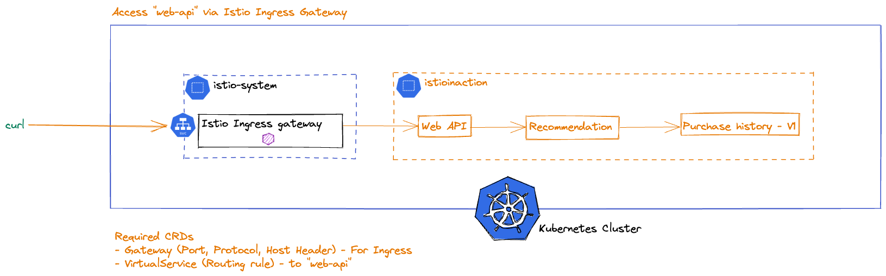
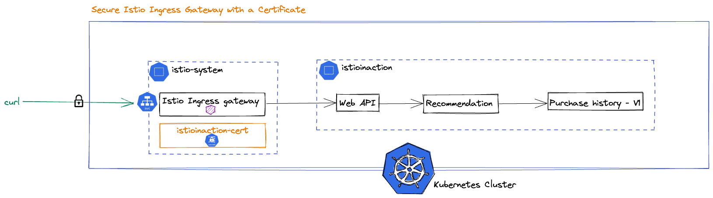

# Istio Fundamental Labs

One of the quickest ways to get started with Istio is to leverage the demo profile. The demo profile is designed to showcase Istio functionality with modest resource requirements. The demo profile contains an Istio control plane (also called Istiod), Istio ingress-gateway and egress-gateway, and a few add-on components.

## Install Istio

In this lab, you will install Istio with the demo profile. You will validate the installation is successful and examine the installation artifacts. While you can use either istioctl, Helm, or the Istio operator to install Istio, in this lab you will use istioctl.

Note: If you open the Prometheus/Grafana/Jaeger/Kiali UI tab, you will see the "Please wait, we are trying to connect to the service..." message. This is normal before these services are installed.

### Download Istio

1. Download the Istio release binary:

    ```
    curl -L https://istio.io/downloadIstio | ISTIO_VERSION=${ISTIO_VERSION} sh -
    ```

2. Add the istioctl client to the PATH:

    ```
    export PATH=$PWD/istio-${ISTIO_VERSION}/bin:$PATH
    ```

3. Check istioctl version:

    ```
    istioctl version
    ```

4. Check if your Kubernetes environment meets Istio's platform requirement:

    ```
    istioctl x precheck
    ```

The precheck response should indicate that no issues were found:

    ✔ No issues found when checking the cluster. Istio is safe to install or upgrade!
        To get started, check out https://istio.io/latest/docs/setup/getting-started/

### Install Istio

List available installation profiles:

istioctl profile list

Since this is a getting started workshop, you will use the demo profile to install Istio.

istioctl install --set profile=demo -y

You should see output that indicates each Istio component is installed successfully. Check out the resources installed by Istio:

kubectl get all,cm,secrets,envoyfilters -n istio-system

Check out Custom Resource Definitions (CRDs) installed by Istio:

kubectl get crds -n istio-system

Verify the installation using the following command:

istioctl verify-install

You should see the following at the end of the output to indicate that your Istio is installed successfully:

✔ Istio is installed and verified successfully

### Install Istio Telemetry Add-ons

Istio telemetry add-ons are shipped as samples, but these add-ons are optimized for quick getting started and demo purposes and not for production usage. They provides a convenient way to install telemetry components that integrate with Istio.

kubectl apply -f istio-${ISTIO_VERSION}/samples/addons

Wait till all pods in the istio-system are running:

kubectl get pods -n istio-system

Enable access to the Prometheus dashboard:

istioctl dashboard prometheus --browser=false --address 0.0.0.0

Click on the Prometheus UI tab, you should be able to view the Prometheus UI from there. Press ctrl+C to end the prior command, and use the command below to enable access to the Grafana dashboard:

istioctl dashboard grafana --browser=false --address 0.0.0.0

Click on the Grafana UI tab, and you should be able to view the Grafana UI. Press ctrl+C to end the prior command, and use the command below to enable access to the Jaeger dashboard:

istioctl dashboard jaeger --browser=false --address 0.0.0.0

Click on the Jaeger UI tab, and you should be able to view the Jaeger UI. Press ctrl+C to end the prior command, and use the command below to enable access to the Kiali dashboard:

istioctl dashboard kiali --browser=false --address 0.0.0.0

Click on the Kiali UI tab, and you should be able to view the Kiali UI. Press ctrl+C to end the prior command. You will not see much telemetry data on any of these dashboards now, as you don't have any services defined in the Istio service mesh yet. You will revisit these dashboards soon.

## Istio Ingress Gateway

In this lab, you will deploy a sample application to your Kubernetes cluster, expose the web-api service to the Istio ingress gateway, and configure secure access to the service. The ingress gateway allows traffic into the mesh. If you need more sophisticated edge gateway capabilities (such as request transformation, OIDC, LDAP, OPA, etc.) then you should use a gateway specifically built for those use cases like Gloo Edge.

### Prerequisites

Verify you're in the correct folder for this lab: /root/istio-workshops/istio-basics. This lab builds on the first lab where you installed Istio and its add-on components using the demo profile.

cd /root/istio-workshops/istio-basics

### Deploy the sample application

You will use the web-api, recommendation, and purchase-history services built using the fake service as your sample application. The web-api service calls the recommendation service via HTTP, and the recommendation service calls the purchase-history service, also via HTTP.

Set up the istioinaction namespace for our services:

```
kubectl create ns istioinaction
```

Deploy the web-api, recommendation and purchase-history services along with the sleep service into the istioinaction namespace:

kubectl apply -n istioinaction -f sample-apps/web-api.yaml
kubectl apply -n istioinaction -f sample-apps/recommendation.yaml
kubectl apply -n istioinaction -f sample-apps/purchase-history-v1.yaml
kubectl apply -n istioinaction -f sample-apps/sleep.yaml

After running these commands, you should check that all pods are running in the istioinaction namespace:

kubectl get po -n istioinaction

Wait a few seconds until all of them show a Running status.

### Configure the inbound traffic

The Istio ingress gateway will create a Kubernetes Service of type LoadBalancer. Use this GATEWAY_IP address to reach the gateway:

kubectl get svc -n istio-system

Store the ingress gateway IP address in an environment variable.

export GATEWAY_IP=$(kubectl get svc -n istio-system istio-ingressgateway -o jsonpath="{.status.loadBalancer.ingress[0].ip}")
export INGRESS_PORT=80
export SECURE_INGRESS_PORT=443

### Expose our apps



Even though you don't have apps defined in the istioinaction namespace in the mesh yet, you can still use the Istio ingress gateway to route traffic to them. Using Istio's Gateway resource, you can configure what ports should be exposed, what protocol to use, etc. Using Istio's VirtualService resource, you can configure how to route traffic from the Istio ingress gateway to your web-api service.

1. Review the Gateway resource:

cat sample-apps/ingress/web-api-gw.yaml

2. Review the VirtualService resource:

cat sample-apps/ingress/web-api-gw-vs.yaml

Why is port number 8080 shown in the destination route configuration for the web-api-gw-vs VirtualService resource? Check the service port for the web-api service in the istioinaction namespace:

kubectl get service web-api -n istioinaction

You can see the service listens on port 8080.

Apply the Gateway and VirtualService resources to expose your web-api service outside of the Kubernetes cluster:

kubectl -n istioinaction apply -f sample-apps/ingress/

The Istio ingress gateway will create new routes on the proxy that you should be able to call from outside of the Kubernetes cluster:

curl -H "Host: istioinaction.io" http://$GATEWAY_IP:$INGRESS_PORT

Query the gateway configuration using the istioctl proxy-config command:

istioctl proxy-config routes deploy/istio-ingressgateway.istio-system

If you want to see an individual route, you can ask for its output as json like this:

istioctl proxy-config routes deploy/istio-ingressgateway.istio-system --name http.8080 -o json

### Secure the inbound traffic



Secure Istio Ingress Gateway

To secure inbound traffic with HTTPS, you need a certificate with the appropriate SAN and you will need to configure the Istio ingress-gateway to use it.

Create a TLS secret for istioinaction.io in the istio-system namespace:

kubectl create -n istio-system secret tls istioinaction-cert --key labs/02/certs/istioinaction.io.key --cert labs/02/certs/istioinaction.io.crt

Update the Istio ingress-gateway to use this cert:

cat labs/02/web-api-gw-https.yaml

Note, we are pointing to the istioinaction-cert and that the cert must be in the same namespace as the ingress gateway deployment. Even though the Gateway resource is in the istioinaction namespace, the cert must be where the gateway is actually deployed.

Apply the web-api-gw-https.yaml in the istioinaction namespace. Since this gateway resource is also called web-api-gateway, it will replace our prior web-api-gateway configuration for port 80.

kubectl -n istioinaction apply -f labs/02/web-api-gw-https.yaml

Call the web-api service through the Istio ingress-gateway on the secure 443 port:

curl --cacert ./labs/02/certs/ca/root-ca.crt -H "Host: istioinaction.io" https://istioinaction.io:$SECURE_INGRESS_PORT --resolve istioinaction.io:$SECURE_INGRESS_PORT:$GATEWAY_IP

If you call it on the 80 port with http, it will not work as you no longer have the gateway resource configured to be exposed on port 80.

curl -H "Host: istioinaction.io" http://$GATEWAY_IP:$INGRESS_PORT

### Mesh Metrics

Now that we have an Istio gateway running and receiving traffic, we can now visualize information about the traffic we just generated.

Click on the Grafana UI tab and we should start to see some mesh metrics appearing.